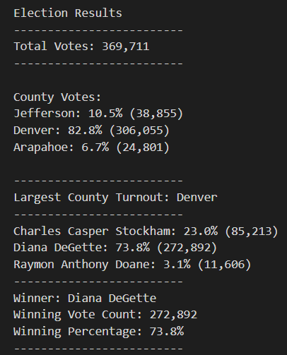

# Election_Analysis
## Challenge Overview
The purpose of this project is to create an election-audit by obtaining information from a csv file with election poll information. The election-audit containing the following information will be added to a text file: 
1) Total number of votes cast.
2) Total number of votes and percentage of votes for each county.
3) County with the largest voter turnout.
4) Total number of votes and percentage of votes for each candidate.
5) Winner of the election along with their vote count and percentage.
## Resources
- Data Source: election_results.csv
- Software: Python 3.7.6, Visual Studio Code 1.68.1
## Election-Audit Results
### Specified "Asks":
* How many votes were cast in this congressional election?
    * Total votes = 369,711
* Provide a breakdown of the number of votes and the percentage of total votes for each county?
    * Jefferson: 38,855 votes with 10.5% of the total votes.
    * Denver: 306,055 votes with 82.8% of the total votes.
    * Arapahoe: 24,801 votes with 6.7% of the total votes.
* Which county had the largest number of votes?
    * Denver 
* Provide a breakdown of the number of votes and the percentage of the total votes each candidate received.
    * Charles Casper Stockham: 85,213 votes with 23.0% of the total votes.
    * Diana DeGette: 272,892 votes with 73.8% of the total votes.
    * Raymon Anthony Doane: 11,606 votes with 3.1% of the total votes. 
* Which candidate won the election, what was their vote count, and what was their percentage of the total votes?
    * The winner of the election was Diane DeGette with 272,892 votes and 73.8% of the total votes.  
### Results as recorded in election_analysis.txt file:

## Election-Audit Summary
This script can be used for other csv files containing voter information and can be used for elections of similar scale. The script makes it possible that all variables change depending on the csv file being read. The only modifications that would need to be made for different elections would be the source csv file used and a different text file to put the election-audit in. 